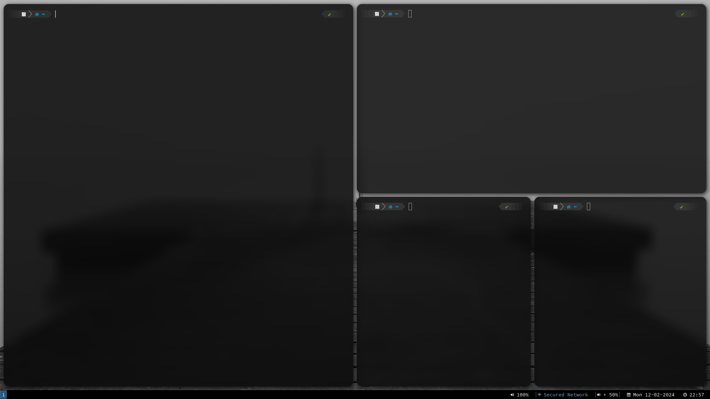

# These are the dotfiles for the i3wm

## Installation
- you need to install the following packages
1. ``kitty`` : terminal
2. ``picom`` : transparent background and rounded edge and more
3. ``playerctl`` : play/pause button
4. ``brightnessctl`` :adjust brightness
5. ``i3gaps`` : gaps
6. ``nmtui`` : connect network (Network Manager)
7. ``pactl`` : volume control
8. ``i3exit`` : exit
9. ``lightdm`` : display manager
10. ``redshift`` : nightmode (less bluelight)
11. ``spectacle`` :screenshots

## To make better
Use rofi for dmenu and polybar for the status bar

### Keybindings
- Super or Windows Key : `mod`
- Open Terminal : `mod + Return`
- Open File Manager : `mod + Shift + Return`
- Switch Workspace : `mod + 1`, `mod + 2` upto `mod + 0`
- Move Window to Specific Workspace : `mod + Shift + {Workspace Number}`
- Application Menu : `mod + d`
- Power Menu : `mod + o`
- Restart i3 : `mod + Shift + r`
- Close Application : `mod + q`
- Toggle Tiling / Floating : `mod + Shift + space`
- Focus Up : `mod + up`
- Focus Right : `mod + right`
- Focus Down : `mod + down`
- Focus Left : `mod + left`
- Move Focused Window to Up : `mod + Shift + up`
- Move Focused Window to Right : `mod + Shift + right`
- Move Focused Window to Down : `mod + Shift + down`
- Move Focused Window to Left : `mod + Shift + left`
- Next Workspace : `Alt + Tab`
- Previous Workspace : `Alt + Shift + Tab`
- Back and Forth between Workspaces : `mod + Tab`
- Split in Horizontal Orientation : `mod + h`
- Split in Vertical Orientation : `mod + v`
- Toggle Fullscreen : `mod + f`
- Stacked Layout : `mod + s`
- Tabbed Layout : `mod + w`
- Split Layout : `mod + e`
- Change Focus between Tiling / Floating Windows : `mod + space`
- Kill task : `mod+ctrl+x`

